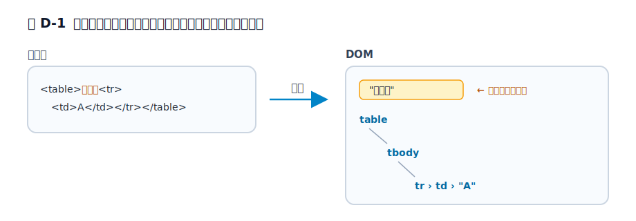

# 付録D 本編の外側にある HTML の補論

本編の流れには入れなかったものの、HTML の設計や実装を理解するうえで補助線になる論点を集めました。どれも、現在のブラウザで実際に確かめられます。

## なぜ `<!DOCTYPE html>` と書くのか

HTML ファイルの先頭にある `<!DOCTYPE html>`。多くの人は「おまじない」として書いていますが、これにはちゃんと理由があります。しかも、見た目より変な事情を抱えています。

まず、この行は**もう「文書型の宣言」としてはほとんど意味を持っていません**。HTML5 では、`<!DOCTYPE html>` の唯一の仕事は、ブラウザを **Quirks Mode（互換モード）に入れないこと**です。

昔の DOCTYPE は、こんなに長いものでした。

```html
<!DOCTYPE HTML PUBLIC "-//W3C//DTD HTML 4.01//EN" "http://www.w3.org/TR/html4/strict.dtd">
```

誰も覚えられないので、みんなコピペしていました。HTML5 はこれを `<!DOCTYPE html>` まで短くしました。中身を理解させることをあきらめ、「Quirks Mode を切るスイッチ」と割り切ったのです。

では、DOCTYPE を書き忘れるとどうなるのか。ブラウザは **Quirks Mode** に入り、1990 年代の挙動をわざと再現します。とくに有名なのが**箱モデルの違い**で、Quirks Mode では `width` に指定した値の中に padding と border が含まれてしまいます。同じ CSS なのに、DOCTYPE の有無だけでレイアウトが静かにずれる——これが昔の Web 制作者を苦しめました。

ちなみにモードは 2 つではなく、`<!DOCTYPE html>` の「標準モード」、何もない「Quirks Mode」、その中間の「Limited-Quirks（ほぼ標準）モード」の 3 つがあります。`<!DOCTYPE html>` という短い呪文は、スキーマの宣言ではなく、互換性のスイッチだったわけです。

## `</script>` は文字列の中でも効いてしまう

`script` 要素の中身は、HTML パーサーにとって「生テキスト」です。パーサーは JavaScript の文法を理解しているわけではなく、最初に現れた `</script>` を見つけた瞬間にスクリプトの終わりだと判断します。

だから、次のコードは壊れます。

```html
<script>
  document.write("</script>");
</script>
```

人間には「`</script>` は文字列の中身」だと分かりますが、パーサーは文字列の途中でもおかまいなしに、最初の `</script>` でスクリプトを閉じてしまいます。回避するには、終了タグに見えないように書きます。

```html
<script>
  document.write("<\/script>");
</script>
```

`<\/script>` の `\/` は JavaScript では `/` と同じ意味なので、動作は変わりません。それでいて、HTML パーサーには `</script>` として見えなくなります。

## `&` を書くだけでは `&` と表示されないことがある

HTML で `&` は、特別な文字です。`&` は**文字参照**の始まりとして扱われるため、`&amp;` と書いてはじめて画面に `&` が出ます。同じように `<` は `&lt;`、`>` は `&gt;`、改行しない空白は `&nbsp;`、著作権マークは `&copy;`(©)で表します。

面白いのは、**一部の古い文字参照はセミコロンを付け忘れても表示される**ことです。たとえば `&copy` とだけ書いても、多くのブラウザは © を出します。ただしこれは互換性のための救済で、仕様上は parse error(問題のある入力)です。`&copy;` と正しく書くのが本筋です。

URL を書くときも要注意です。`?a=1&b=2` をそのまま属性値に書くと、`&b` が文字参照と解釈されかねません。HTML としては `?a=1&amp;b=2` と書くのが正確です。

## `<table>` の直下に書いたテキストは表の外へ飛ぶ

第5章で、表は行グループの入れ子構造だと見ました。では、その構造を無視して、`table` の直下にいきなりテキストを書いたらどうなるでしょうか。

```html
<table>おっと<tr><td>A</td></tr></table>
```

直感的には「`table` の中に "おっと" がある」と思いたくなります。ところが DevTools で DOM を見ると、こうなります。

```html
おっと
<table>
  <tbody>
    <tr><td>A</td></tr>
  </tbody>
</table>
```

**"おっと" は表の中ではなく、表の前へ追い出されます。** これは **foster parenting(里親付け)** と呼ばれる、HTML パーサーの正式な動作です。表の中に置けないものが来たとき、パーサーはそれを捨てず、表の直前へ「里子に出す」のです。

<figure>

<figcaption>図 D-1　表の中に置けないテキストは、表の前へ追い出される。</figcaption>
</figure>

第4章から第7章で見た補完やエラー回復は、ふわっとした「親切」ではなく、こうした名前の付いた規則(パーサーの挿入モードという状態機械)の集まりでした。foster parenting は、その機械じかけがいちばん見えやすい瞬間です。手元のブラウザで、ぜひ DevTools を開いて確かめてみてください。

## 文字コードを間違えると、文字が化ける

ブラウザは、HTML を読み始める時点では「この文書が何の文字コードで書かれているか」を完全には知りません。だから `<meta charset="utf-8">` で教えてあげます。これは飾りではなく、**`<head>` のなるべく早い位置**に置く必要があります。指定が遅れると、ブラウザはいったん読んだ分を別の文字コードで読み直すことになるからです。

この指定を忘れたり間違えたりすると、日本語が「譁・喧縺・」のように化けます。かつての Web では、この**文字化け**は日常の風景でした。`charset` は、その地獄を防ぐための短い一行です。

## 半角スペースをいくら並べても、1 個にまとめられる

HTML の本文では、連続した空白(スペース・タブ・改行)は、表示されるときに**1 個の空白へ畳み込まれます**。

```html
<p>あ        い</p>
```

これを開いても、「あ」と「い」のあいだは 1 文字分しか空きません。スペースを並べて余白を作ろうとしても効かないのは、このためです(`<pre>` 要素や CSS の `white-space` を使えば別です)。HTML は、ソースの見た目の空白と、表示上の空白を、わざと切り離しています。

## `<template>` の中身は、 DOM にいるのにいない

`<template>` 要素は、変わり種です。中に書いた HTML は**パースはされるのに、画面には出ず、通常の DOM ツリーにも入りません**。中の `img` は読み込まれず、`script` も動きません。JavaScript から `template.content` を取り出して複製したときに、はじめて本物の DOM として動き出します。「書いてあるのに、まだ存在していない」——UI の雛形を安全に持っておくための、静かな仕掛けです。

## どんな要素も、その場で編集可能にできる

要素に `contenteditable` を付けると、その部分はブラウザ上で**直接書き換えられる**ようになります。

```html
<p contenteditable>ここをクリックして書き換えてみてください。</p>
```

メモアプリのような編集欄を、`textarea` を使わずに作れます。ちなみに、開発者ツールのコンソールで `document.designMode = "on"` と打つと、**いま開いているどんなサイトでも**その場で文字を書き換えられます(リロードで元に戻ります)。HTML が「読む専用」ではないことを、いちばん手軽に体験できる小ネタです。

## 参考資料

* [HTML Living Standard: The DOCTYPE](https://html.spec.whatwg.org/multipage/syntax.html#the-doctype)
* [MDN Web Docs: Quirks Mode and Standards Mode](https://developer.mozilla.org/ja/docs/Web/HTML/Guides/Quirks_Mode_and_Standards_Mode)
* [HTML Living Standard: Restrictions for contents of script elements](https://html.spec.whatwg.org/multipage/scripting.html#restrictions-for-contents-of-script-elements)
* [HTML Living Standard: Named character references](https://html.spec.whatwg.org/multipage/named-characters.html)
* [HTML Living Standard: Foster parenting](https://html.spec.whatwg.org/multipage/parsing.html#foster-parent)
* [MDN Web Docs: `<meta charset>` で文字エンコーディングを指定する](https://developer.mozilla.org/ja/docs/Web/HTML/Reference/Elements/meta)
* [MDN Web Docs: How whitespace is handled by HTML, CSS](https://developer.mozilla.org/en-US/docs/Web/API/Document_Object_Model/Whitespace)
* [MDN Web Docs: `<template>`](https://developer.mozilla.org/ja/docs/Web/HTML/Reference/Elements/template)
* [MDN Web Docs: `contenteditable`](https://developer.mozilla.org/ja/docs/Web/HTML/Reference/Global_attributes/contenteditable)
