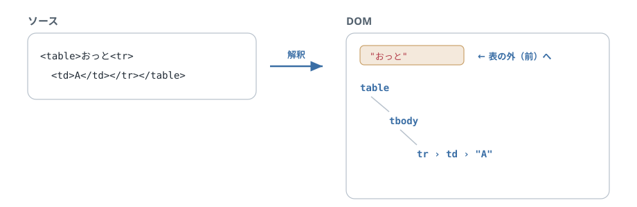

# 付録 D 本編の外側にある HTML の補論

本編の流れには入れなかったものの、HTML の設計や実装を理解するうえで補助線になる論点を集めました。本文断片は、[第4章](../part2/chapter4.md)の確認用文書の body に入れて試せます。DOCTYPE と文字コードの例は文書全体に関わります。

## なぜ `<!DOCTYPE html>` と書くのか

HTML ファイルの先頭にある `<!DOCTYPE html>`。多くの人は「おまじない」として書いていますが、これにはちゃんと理由があります。しかも、見た目より変な事情を抱えています。

text/html として読む現行 HTML では、`<!DOCTYPE html>` は主にブラウザを標準モードにするために必要です。DTD を取得して文書を検証させる指示ではありません。XML の文書型宣言の働きと混同しないようにします。

昔の DOCTYPE は、こんなに長いものでした。

```html
<!DOCTYPE HTML PUBLIC "-//W3C//DTD HTML 4.01//EN" "http://www.w3.org/TR/html4/strict.dtd">
```

HTML5 では短い `<!DOCTYPE html>` が使われるようになりました。歴史的な DOCTYPE の有無や種類が描画モードの切り替えに使われてきたため、現行 HTML でもその互換性を踏まえた指定を残しています。

では、DOCTYPE を書き忘れるとどうなるのか。ブラウザは **Quirks Mode** に入り、1990 年代の挙動をわざと再現します。とくに有名なのが**箱モデルの違い**で、Quirks Mode では `width` に指定した値の中に padding と border が含まれてしまいます。同じ CSS なのに、DOCTYPE の有無だけでレイアウトが静かにずれる——これが昔の Web 制作者を苦しめました。

ちなみにモードは 2 つではなく、`<!DOCTYPE html>` の「標準モード」、何もない「Quirks Mode」、その中間の「Limited-Quirks（ほぼ標準）モード」の 3 つがあります。`<!DOCTYPE html>` という短い呪文は、スキーマの宣言ではなく、互換性のスイッチだったわけです。

## `</script>` は文字列の中でも効いてしまう

script 要素の内容は、HTML パーサーのスクリプト用の状態で処理されます。JavaScript の文字列の境界を理解して読み飛ばすわけではないため、次の例では文字列中の `</script>` が終了タグになります。

だから、次のコードは壊れます。

```html
<script>
  document.write("</script>");
</script>
```

人間には「`</script>` は文字列の中身」だと分かりますが、パーサーは文字列の途中でもおかまいなしに、最初の `</script>` でスクリプトを閉じてしまいます。回避するには、終了タグに見えないように書きます。

```html
<script>
  document.write("<\/script>");
</script>
```

ここでの document.write は境界を示すための例で、新しい UI を作る方法として勧めるものではありません。

`<\/script>` の `\/` は JavaScript では `/` と同じ意味なので、JavaScript が作る文字列の値は同じです。それでいて、HTML パーサーには `</script>` として見えなくなります。

## `&` を書くだけでは `&` と表示されないことがある

HTML の `&` は文字参照の開始になり得ますが、すべてが変換されるわけではありません。

```html
<p>A & B</p>
<p>&copy;</p>
<p>&amp;copy;</p>
<a href="?a=1&b=2">条件を指定</a>
```

最初は「A & B」、次は「©」、三つ目は文字列「&copy;」として表示されます。最後の引用符付き属性値では、この `&b` は文字参照に変換されません。HTML ソースでアンパサンドを確実に表す表記として `&amp;` を使えますが、「そのままの & は必ず化ける」という説明は誤りです。

一部の古い名前付き文字参照は、本文中の `&copy` のようにセミコロンがなくても解釈されます。ただし、この場合はパースエラーです。属性値ではさらに、セミコロンのない名前の直後が ASCII 英数字や等号なら変換しないという互換規則があります。著者は省略に頼らず `&copy;` と書きます。

HTML の文字参照と、URL のパーセントエンコードは別の処理です。`href="?a=1&amp;b=2"` は DOM 上で `?a=1&b=2` になりますが、URL の値そのものへアンパサンドを含めたい場合のエンコードとは目的が違います。

## `<table>` の直下に書いたテキストは表の外へ飛ぶ

[第5章](../part2/chapter5.md)で、表は行グループの入れ子構造だと見ました。では、その構造を無視して、`table` の直下にいきなりテキストを書いたらどうなるでしょうか。

```html
<table>おっと<tr><td>A</td></tr></table>
```

直感的には「`table` の中に "おっと" がある」と思いたくなります。ところが DevTools で DOM を見ると、こうなります。

```html
おっと
<table>
  <tbody>
    <tr><td>A</td></tr>
  </tbody>
</table>
```

**"おっと" は表の中ではなく、表の前へ追い出されます。** これは **foster parenting(里親付け)** と呼ばれる、HTML パーサーの正式な動作です。表の中に置けないものが来たとき、パーサーはそれを捨てず、表の直前へ「里子に出す」のです。

<figure>

<figcaption>図 D-1　表の中に置けないテキストは、表の前へ追い出される。</figcaption>
</figure>

[第4章](../part2/chapter4.md)から[第7章](../part2/chapter7.md)で見た補完やエラー回復は、ふわっとした「親切」ではなく、こうした名前の付いた規則(パーサーの挿入モードという状態機械)の集まりでした。foster parenting は、その機械じかけがいちばん見えやすい瞬間です。手元のブラウザで、ぜひ DevTools を開いて確かめてみてください。

## 文字コードを間違えると、文字が化ける

日本語の HTML は、実際のファイルを UTF-8 で保存し、head の早い位置に `<meta charset="utf-8">` を置きます。宣言を書くだけで、別の文字コードで保存したバイト列が UTF-8 へ変換されるわけではありません。

宣言全体は文書の先頭から 1024 バイト以内に収める必要があります。ブラウザが早い段階で文字コードを判断できるようにするためです。

文字コードの情報源は meta だけではありません。通常の HTML の判定では BOM（先頭のバイト列による印）が優先され、HTTP の Content-Type の charset も文書内の meta より優先されます。利用者による明示的な指定などもあるため、文字化けの調査では実際の保存形式、レスポンスヘッダー、BOM、meta を照合します。UTF-8 の文書に対し、サーバーが別の文字コードを宣言していないかが確認点です。

## 半角スペースをいくら並べても、1 個にまとめられる

通常の CSS の空白処理では、連続する半角スペースは表示時に一つへ畳み込まれます。タブや改行の処理にも CSS の規則があり、DOM の文字列から空白そのものがすべて削除されるわけではありません。

```html
<p>あ        い</p>
```

これを開いても、「あ」と「い」のあいだは 半角スペース 1 個相当しか空きません。スペースを並べて余白を作ろうとしても効かないのは、このためです(`<pre>` 要素や CSS の `white-space` を使えば別です)。HTML は、ソースの見た目の空白と、表示上の空白を、わざと切り離しています。

## template の内容は別の DocumentFragment にある

template の中身は、パースされて DOM ノードになります。ただし、通常の子要素として表示されるのではなく、`template.content` が返す DocumentFragment に格納されます。複製しただけではページへ表示されません。

```html
<template id="notice-template">
  <p>受付を開始しました。</p>
</template>
<div id="notices"></div>
<script>
  const content = document.querySelector('#notice-template').content;
  const copy = content.cloneNode(true);
  document.querySelector('#notices').append(copy);
</script>
```

内容の取得、複製、文書への挿入という三段階です。最後の append で、複製した p が表示側の DOM に入ります。元の template は雛形として残ります。

## 内容をその場で編集できる領域にする

要素に `contenteditable` を付けると、その部分はブラウザ上で**直接書き換えられる**ようになります。

```html
<p contenteditable>ここをクリックして書き換えてみてください。</p>
```

メモアプリのような編集欄を、`textarea` を使わずに作れます。ちなみに、開発者ツールのコンソールで `document.designMode = "on"` と打つと、現在の文書の内容を編集できる状態にできます。別フレームやアプリ固有の制御には制限があります。これは手元の表示の変更であり、サーバーへ保存されるわけではありません。保存の仕組みがなければリロードで失われます。HTML が「読む専用」ではないことを、いちばん手軽に体験できる小ネタです。

## 参考資料

* [HTML Living Standard: The DOCTYPE](https://html.spec.whatwg.org/multipage/syntax.html#the-doctype)
* [MDN Web Docs: Quirks Mode and Standards Mode](https://developer.mozilla.org/ja/docs/Web/HTML/Guides/Quirks_Mode_and_Standards_Mode)
* [HTML Living Standard: Restrictions for contents of script elements](https://html.spec.whatwg.org/multipage/scripting.html#restrictions-for-contents-of-script-elements)
* [HTML Living Standard: Named character references](https://html.spec.whatwg.org/multipage/named-characters.html)
* [HTML Living Standard: Foster parenting](https://html.spec.whatwg.org/multipage/parsing.html#foster-parent)
* [MDN Web Docs: `<meta charset>` で文字エンコーディングを指定する](https://developer.mozilla.org/ja/docs/Web/HTML/Reference/Elements/meta)
* [MDN Web Docs: How whitespace is handled by HTML, CSS](https://developer.mozilla.org/en-US/docs/Web/API/Document_Object_Model/Whitespace)
* [MDN Web Docs: `<template>`](https://developer.mozilla.org/ja/docs/Web/HTML/Reference/Elements/template)
* [MDN Web Docs: `contenteditable`](https://developer.mozilla.org/ja/docs/Web/HTML/Reference/Global_attributes/contenteditable)

* [HTML Living Standard: Determining the character encoding](https://html.spec.whatwg.org/multipage/parsing.html#determining-the-character-encoding)
* [HTML Living Standard: Character encoding declaration](https://html.spec.whatwg.org/multipage/semantics.html#charset)
* [HTML Living Standard: The template element](https://html.spec.whatwg.org/multipage/scripting.html#the-template-element)
