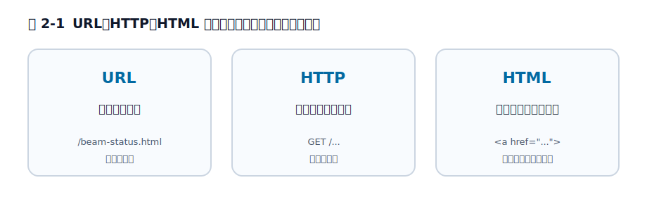

# 第2章 HTML は何を解決したかったのか

この章では、HTML を単なるタグの集合ではなく、CERN（欧州原子核研究機構）における情報共有の問題への答えとして捉えます。ゴールは、HTML を URL や HTTP から切り離さずに説明し、「文書構造を記述する言語」という前章の整理が、どんな現実の困りごとから必要になったのかを説明できるようになることです。

前章では、HTML は処理を書く言語ではなく、文書構造を記述する言語だと見ました。しかし、それだけではまだ「なぜそんな言語が必要だったのか」は見えてきません。この章では、1980 年代末から 1990 年代初頭の CERN に戻り、HTML が何を解決したかったのかを確認します。

CERN（欧州原子核研究機構）は、スイスとフランスの国境近くにある、世界最大級の素粒子物理学の研究所です。巨大な実験装置を使って、物質を形づくるいちばん小さな粒を調べています。ここには世界中から大勢の研究者が出入りし、たくさんの計算機と文書が日々やり取りされていました。

「物理学の研究所から、なぜ Web が?」と意外に思うかもしれません。でも、これは偶然ではありません。これだけ大規模で国際的な現場だったからこそ、**「情報はあるのに、必要なものへたどり着けない」という切実な問題**を、誰よりも先に抱えていたのです。Web は、その困りごとへの答えとして生まれました。次章では、その問題に対してなぜ PDF や Word ではなく HTML が Web の中心になったのかを比較します。

## 2.1 HTML が必要になったのは、情報がないからではなく、つながっていなかったから

1980 年代末の CERN には、研究者も文書も大量にありました。問題は、情報そのものが不足していたことではありません。むしろ逆で、情報はあるのに**参照しづらく、つながっていない**ことが大きな痛みでした。

研究グループごとに使う計算機が違い、保存場所も違い、文書形式も違う。ある装置の説明書、別の研究チームのメモ、さらにその関連論文がそれぞれ別の場所にあり、誰が何を管理しているかも分かりにくい。新しく来た研究者にとっては、「必要な情報が存在すること」と「必要な情報へたどり着けること」が別問題でした。

Tim Berners-Lee（ティム・バーナーズ＝リー）が 1989 年の提案書で問題にしたのは、まさにこの点です。提案書では、組織の中に人、装置、ソフトウェア、文書の関係が「mesh（網）」のように広がっているのに、それを横断してたどる道具が足りないと説明されています。人や装置や文書の関係が複雑に絡み合っているのに、それを横断して参照する共通の仕組みがない。だから必要だったのは、豪華な文書編集ソフトではなく、**異なる環境の情報どうしを結びつけるための最小の共通基盤**でした。

ここで重要なのは、出発点が「きれいなページを作りたい」ではなかったことです。必要だったのは、まず届くこと、参照できること、別の文書へ飛べることでした。HTML の性格を理解するとき、この出発点を忘れると、後の仕様の寛容さや単純さが見えなくなります。

## 2.2 ハイパーテキストは、文書を閉じた完成品ではなく参照の網に変えた

CERN の問題に対して、核になった発想は**ハイパーテキスト**でした。これは、文書の中から別の文書や別の項目へ飛べるようにする考え方です。紙の文書にも「参考: 第3章」や脚注はありますが、ハイパーテキストでは参照先へそのまま移動できます。要するに、文書を単体で閉じた読み物としてではなく、別の文書とつながる入り口つきの文書として扱う発想です。

最小の形で書けば、HTML のリンクはこうです。

```html
<p>
  装置の仕様は
  <a href="detector-spec.html">こちらの文書</a>
  を参照してください。
</p>
```

この例で大事なのは、見た目ではありません。下線が付くか、青く表示されるかは本質ではない。重要なのは、「この文書のこの部分は、別の文書への参照である」と機械にも人間にも分かることです。

ここで前章の話がつながってきます。HTML が構造や役割を書く言語であることは、リンクにとって特に重要でした。リンクは単に文字列を飾る装飾ではなく、文書どうしを結びつける役割です。だから HTML に必要だったのは、複雑な計算より、見出し、段落、リスト、リンクのような文書の部品でした。

この時点で、HTML の「小ささ」は制約というより戦略だったと言えます。解こうとしていた問題が、最初からアプリケーションの UI 構築ではなく、文書を相互参照可能にすることだったからです。

## 2.3 Web は URL ・ HTTP ・ HTML の分業で成り立っている

ここまで読むと、HTML だけ見ていても全体像が分からない理由がはっきりしてきます。Web は最初から、ひとつの技術で完結するようには作られていませんでした。少なくとも次の 3 つが分業しています。

1. URL は「何を取りに行くか」を示す
2. HTTP は「どう取りに行くか」を示す
3. HTML は「取りに行った文書がどんな構造か」を示す

同じ参照でも、役割を混ぜると理解が崩れます。まず URL だけを取り出すと、見えているのは参照先の識別子です。

```text
https://example.org/reports/beam-status.html
```

この文字列だけでは、そこに何があるかは分かっても、「その中身がどういう構造か」は分かりません。次に HTTP を考えると、ここで扱っているのは取得のやり方です。たとえば概念的には、クライアントは「この場所の文書をください」と要求し、サーバーは本文を返します。

```http
GET /reports/beam-status.html HTTP/1.1
Host: example.org
```

> 補足: ここでは現在よく見る形で示しています。Web 黎明期の HTTP はもっと素朴で、バージョン表記も `Host:` 行もなく、`GET /...` の一行だけでした（いわゆる HTTP/0.9）。役割を説明するために、ここでは現代的な書き方を借りています。

ここでも、まだ返ってきた本文が見出しなのか、リンクなのか、本文なのかは分かりません。そこで初めて HTML が必要になります。たとえば次のリンクを見てください。

```html
<a href="https://example.org/reports/beam-status.html">
  現在の運転状況
</a>
```

この一行の中には、三つの役割が重なっています。`https://example.org/reports/beam-status.html` という識別先は URL の仕事です。そこへ取りに行く通信の取り決めは HTTP の仕事です。そして、「この文字列は別文書への参照である」という構造を表しているのが HTML の仕事です。

HTML 単体では Web になりません。しかし逆に、URL と HTTP だけでも Web になりません。取得した中身がただのバイト列のままでは、人も機械も「どこが見出しで、どこがリンクで、どこが本文か」を共有できないからです。HTML が解決したかったのは、まさにこの「**取得した文書を、参照可能な構造として共有すること**」でした。

この分業を押さえると、「HTML は何を解決したかったのか」という問いに、少し精密に答えられます。HTML は単独で全部を解決する技術ではなく、URL と HTTP と組み合わさって、**リンク可能な文書空間**を成立させる役割を引き受けていました。

<figure>

<figcaption>図 2-1　URL・HTTP・HTML は、それぞれ別の問いに答える。</figcaption>
</figure>

## 2.4 初期の HTML が小さかったのは、問題設定が小さかったから

現代の HTML 仕様書は巨大です。フォーム、埋め込み、スクリプト、パーサー、エラー回復、アクセシビリティ関連まで含めると、とても「小さな文書形式」には見えません。すると、「そんなに大きい技術が、最初はなぜこんなに単純だったのか」という疑問が出ます。

答えは単純で、最初に解こうとしていた問題がもっと限定されていたからです。初期の HTML で中心だったのは、見出し、段落、リスト、リンクのような文書の基本部品でした。研究者どうしが文書を行き来し、読めればよい。そこでは、今日のような複雑なアプリケーション UI や高機能フォームまではまだ主眼ではありません。

ここで誤解を潰しておきます。初期の HTML が小さかったからといって、「あとから場当たり的に巨大化しただけだ」と片づけるのは雑です。もちろん歴史の積み重ねで仕様は膨らみました。しかし出発点を見ると、HTML は最初から万能環境を目指していたのではなく、共有文書のための最小基盤として始まっていたことが分かります。

この視点は、後の章でも役に立ちます。なぜブラウザが不完全な入力を読めるようにするのか。なぜ古い要素が簡単には消えないのか。なぜ仕様書の大半がパーサーの話になるのか。これらはどれも、「まず文書を読めるようにする」という原点から外れていません。

## 2.5 実務では、 HTML を単独技術として理解しないほうが見通しがよくなる

この章の内容は歴史の話ですが、実務にもそのままつながります。HTML を単独の文法としてだけ見ると、リンク、フォーム送信、埋め込み、ルーティングの話がばらばらに見えます。しかし、URL・HTTP・HTML の分業として見ると、責務の境界がかなり整理されます。

たとえば Rails アプリでも、リンクを置く、フォームを送る、レスポンスとして HTML を返す、という流れは日常的です。`link_to` で URL を組み立て、コントローラが HTTP リクエストを受け、ビューが HTML を返す。このとき HTML がやっているのは、サーバー処理そのものではなく、「返ってきた文書のどこが何であるか」を示すことです。逆に、HTML に本来ない責務まで押しつけて理解しようとすると、ルーティング、通信、構造の境目が曖昧になります。

この章で押さえておきたい判断基準は、HTML を**文書の側の技術**として見ることです。単独の万能技術として見るのではなく、URL と HTTP と並ぶ 1 つの役割として見る。その見方を持つと、次章で HTML と PDF や Word を比べるときも、「何が高機能か」ではなく「何が問題設定に合っていたか」で比べられるようになります。

## 2.6 共有文書のための最小基盤

HTML が最初に解決したかったのは、見た目のよいページを作ることではありませんでした。CERN のような複雑な環境で、異なる文書や人や装置に関する情報を、環境差をまたいで参照できるようにすることでした。そこで必要だったのが、文書に見出しや段落やリンクの役割を与え、ハイパーテキストとして結びつけるための最小の言語でした。

その役割は、URL や HTTP と分業して初めて意味を持ちます。URL が参照先を示し、HTTP が取得手段を示し、HTML が中身の構造を示す。この三つがそろって、Web は単なるファイル置き場ではなく、リンク可能な文書空間になります。

次章では、この問題設定に対して、なぜ HTML が PDF や Word より適していたのかを見ます。HTML の小ささや単純さは、そこで初めて「弱さ」ではなく「条件への適合」として見えてきます。

## 参考資料

* [Tim Berners-Lee: Information Management: A Proposal](https://www.w3.org/History/1989/proposal.html)
* [World Wide Web Consortium: A Little History of the World Wide Web](https://www.w3.org/History.html)
* [HTML Living Standard](https://html.spec.whatwg.org/)
