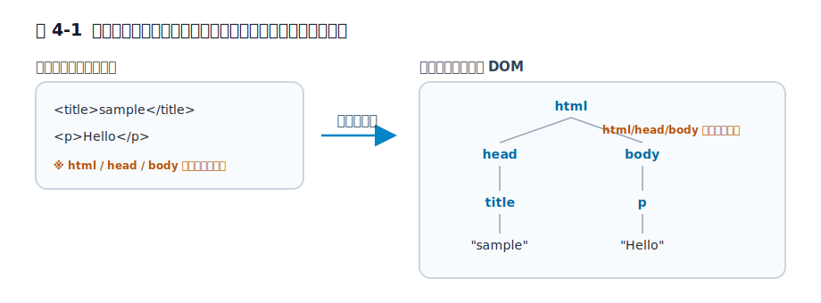

# 第4章 ブラウザはHTMLを完成させる

この章では、HTML ソースがそのまま完成品ではなく、ブラウザが文書として成立する形へ組み立てた結果として DOM ができることを見ます。ゴールは、`html` `head` `body` を書かなかったのに DevTools には現れる、といった現象を「ブラウザの気まぐれ」ではなく、HTML の設計と仕様に基づく挙動として説明できるようになることです。

前章では、Web が必要としていたのは完成した版面より、環境差を越えて共有できる文書空間だったと見ました。この章では、そのような HTML をブラウザがどう受け取り、どこまで完成させるのかを扱います。次章では `tbody` という、より具体的で実務上も引っかかりやすい補完例へ進みます。

## 4.1 ソースコードと完成した文書の不一致

HTML を書いていると、つい「自分が書いた文字列がそのまま表示されている」と考えがちです。しかしブラウザが扱っているのは、受け取った文字列そのものではありません。ブラウザはその文字列を読み取り、規則に従って文書構造へ変換し、その結果として DOM を作ります。

この前提を外すと、あとで出てくる `tbody` や `p` の自動終了がすべて「謎の親切」に見えてしまいます。実際には、HTML は最初から、入力文字列を読みながら文書を組み立てる形式として設計されています。ソースは材料であり、ブラウザが扱う完成形そのものではありません。

ここでいう DOM は、ブラウザが内部で持つ文書構造です。英語では Document Object Model と呼ばれ、HTML を要素どうしの関係として扱うための形です。開発者ツールで見えているのは、受信した元の文字列ではなく、この構造化された結果です。つまり、**HTML では「書いたもの」と「ブラウザが扱うもの」のあいだに、解釈の層が 1 枚入ります。** 文字列が、そのままノードの木へ変換されているわけではなく、途中で「この要素は文書のどこに属するか」を判断する段階が入るのです。

## 4.2 `title` と `p` だけでも成立する文書外枠

最小の例で見てみます。

```html
<title>sample</title>
<p>Hello</p>
```

このソースには、`html` も `head` も `body` も書かれていません。それでもブラウザは、これを壊れた断片として投げ捨てるのではなく、文書として読める形へ組み立てます。おおまかには、次のような構造として扱われます。

```html
<html>
  <head>
    <title>sample</title>
  </head>
  <body>
    <p>Hello</p>
  </body>
</html>
```

ここで重要なのは、「ブラウザが親切で足してくれた」という理解で止めないことです。HTML では、`title` は文書メタデータ側、`p` は本文側に属します。ブラウザはその違いを踏まえて、どこに何を置くべきかを決めながら DOM を組み立てています。

木構造として言えば、`title` を `head` の子に、`p` を `body` の子に置かなければ、文書として扱いにくくなります。ブラウザは単にタグを並べ替えているのではなく、文書モデルに沿う位置へ各要素を収めています。

つまり、入力が短いからといって、ブラウザ内部でも同じ短さのまま扱われるわけではありません。HTML ソースは断片的でも、ブラウザが必要とする文書構造は断片的なままでは済まないのです。

<figure>

<figcaption>図 4-1　ソースは材料。ブラウザが補って文書の木を組み立てる。</figcaption>
</figure>

## 4.3 補完が文書の前提になる理由

この挙動を見ると、「ブラウザが開発者を甘やかしている」と言いたくなるかもしれません。たしかに、他のもっと厳格な形式に慣れていると、入力不足を埋めてくれる振る舞いは甘く見えます。

しかし HTML の文脈では、先にあったのは厳格さではなく、読めることを優先する問題設定でした。前章で見たように、Web が必要としていたのは、異なる環境にある人が同じ文書へ辿りつき、読めることです。その前提に立つと、文書の外枠が少し省略されていても、利用可能な文書として解釈するほうが自然です。

ここでのポイントは、「何でも好きに補ってよい」ではないことです。補完は仕様なしの裁量ではなく、どの要素がどこへ入るか、どの時点で文書の外枠を作るかといった規則に従って行われます。だからブラウザごとに気分で別々の木ができるのではなく、同じ HTML に対しておおむね同じ DOM を作れるのです。

この意味でブラウザは、著者の代わりに文章を書く共同著者ではありません。著者が渡した材料を、読める文書構造へ落とし込む実装です。過度に擬人化しないほうが、このあと出てくる仕様の話も理解しやすくなります。

## 4.4 DevTools が見ているもの

実務で混乱しやすいのは、ここからです。ソースに `body` を書いていないのに、DevTools を開くと `body` が見える。すると「ブラウザが勝手に書き換えた」と感じます。

ですが、DevTools が見せているのは、受信した元の文字列ではなく、解釈後の DOM です。つまり、見えている対象が最初から違います。元のソースと DevTools の内容が一致しないこと自体は、異常ではありません。むしろ HTML では、それが普通に起こります。

この違いを 1 度でも正しく掴むと、後の章でかなり楽になります。`table` の中に `tbody` が現れることも、閉じていない `p` が DOM 上では閉じていることも、「ブラウザが勝手に直した」の一言で片づけずに済むからです。見ているものが文字列なのか、補完後の文書構造なのかを分けて考えられるようになります。

> 手元で確かめる: 空のファイルに `<title>sample</title><p>Hello</p>` の 2 行だけを書いてブラウザで開き、DevTools の Elements パネルを見てください。書いていない `html` `head` `body` が現れ、`title` は `head` の下、`p` は `body` の下に収まっているはずです。同じファイルを「ページのソースを表示（View Source）」で開くと、表示されるのは自分が書いた 2 行のままです。同じページでも、見ているものが違うことを 1 分で体験できます。

実務の調査でも、この切り分けは有効です。レスポンス本文を確認したいなら元の HTML を見るべきですし、CSS や JavaScript が相手にしている対象を確認したいなら DOM を見るべきです。同じ画面を見ていても、何を観察しているかで答えが変わります。

ここではまだ View Source と DevTools の違いを本格的には扱いません。その比較は第8章の役割です。この章ではまず、「ブラウザは受け取った文字列をそのまま見せているのではない」という土台だけ押さえれば十分です。

## 4.5 「ブラウザが勝手にやった」で終わる調査の危うさ

この章の話は、実務でもかなり役立ちます。Rails でテンプレートを書いていると、最終的にブラウザへ届くのは HTML 文字列です。そしてブラウザは、その文字列をそのまま画面へ貼り付けるのではなく、文書として解釈して DOM を組み立てます。

そのため、画面で起きたことを調べるときに、テンプレートの見た目だけで判断すると外しやすくなります。たとえば CSS セレクタが思ったように効かない、JavaScript で取れたノード構造が想定と違う、といった場面では、まず「ブラウザが最終的にどんな DOM を作ったか」を見る必要があります。

ここで重要なのは、ブラウザを責めることではありません。見るべき対象を切り分けることです。テンプレートの文字列を点検したいのか、補完後の DOM を点検したいのか。この区別ができるだけで、HTML まわりの調査はかなり整理されます。

## 4.6 ソースと文書構造のあいだ

ブラウザは HTML ソースをそのまま表示しているのではなく、文書として成立する形へ補完しながら DOM を作っています。`html` `head` `body` が省略されていても文書として読めるのは、その場しのぎの親切ではなく、HTML が最初から「読めること」を重視してきた形式だからです。

この章で大事なのは、ソースコードと完成した文書構造を同一視しないことです。HTML では、開発者が書いた文字列と、ブラウザが扱う文書のあいだに解釈の層があります。この見方を持つと、次章の `tbody` のような補完も、例外的な奇妙さではなく、同じ設計思想の延長として読めるようになります。

## 参考資料

* [HTML Living Standard: The `html` element](https://html.spec.whatwg.org/multipage/semantics.html#the-html-element)
* [HTML Living Standard: Parsing HTML documents](https://html.spec.whatwg.org/multipage/parsing.html)
* [MDN Web Docs: Document Object Model (DOM)](https://developer.mozilla.org/ja/docs/Web/API/Document_Object_Model)
