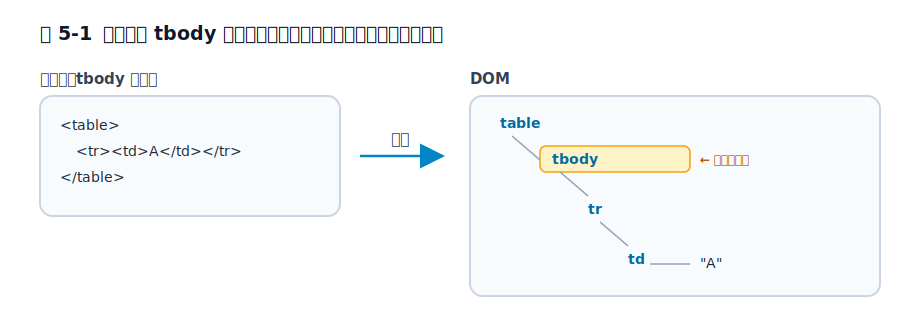

# 第5章 tbody はなぜ生まれるのか

書いた覚えのない `tbody` が、開発者ツールには勝手に現れている——表をいじったことがある人なら、一度は「これは何だ?」と思ったはずです。しかもこの幽霊のような要素のせいで、`table > tr` という CSS が効かなくなります。

この章では、`tbody` が「ブラウザが気を利かせて足す飾り」ではなく、HTML の表モデルが最初から前提にしている本体側の階層であることを見ます。ゴールは、`table > tr` が効かない理由や、DevTools にだけ `tbody` が現れる理由を、単なる挙動の暗記ではなく、表の構造から説明できるようになることです。

前章では、ブラウザが `html` `head` `body` のような文書外枠を補いながら DOM を作ることを見ました。この章では、その補完が表の内部構造でどう現れるのかを扱います。次章では、同じ「内部は厳密・入力は寛容」という設計が `p` 要素の自動終了にどう現れるかを見ます。

## 5.1 表は `tr` の集まりではなく行グループの集まりである

表を書くとき、多くの人は「`table` の中に `tr` が並んでいる」と考えます。ソースコードの見た目だけを見ると、たしかにそう見えます。

しかし HTML の表モデルでは、`table` の直下に来る中心的な構造は行そのものではありません。`thead`、`tbody`、`tfoot` という**行グループ**です。`tr` はその中に入る行であり、表の第一階層ではありません。

概念的には、表は次のような木構造を前提にしています。

```text
table
├─ thead
│  └─ tr
├─ tbody
│  ├─ tr
│  └─ tr
└─ tfoot
   └─ tr
```

このとき `tbody` だけが特別扱いされているわけではありません。`thead` が見出し行のまとまり、`tfoot` が末尾側のまとまりなら、本体行にも対応するまとまりが必要です。その本体側のまとまりが `tbody` です。

短く言えば、`thead` は表の頭、`tfoot` は表の末尾、`tbody` は表の本体です。`tbody` だけが妙に増えるのではなく、もともと 3 種類ある行グループのうち、本体側が省略されやすいので目立っているだけです。つまり `tbody` は後から気まぐれに追加された要素ではなく、表を表らしく扱うための本体側の入れ物です。

## 5.2 `tbody` を書かなくても表の本体階層は立ち上がる

いちばん素朴な表を書いてみます。

```html
<table>
  <tr><td>A</td></tr>
</table>
```

ソースには `tbody` がありません。ところが DevTools で見ると、たいてい次のような DOM になっています。

```html
<table>
  <tbody>
    <tr><td>A</td></tr>
  </tbody>
</table>
```

ここで起きていることは、「本当は不要な要素をブラウザが親切で足した」ではありません。表の本体行は、表モデル上 `tbody` のような行グループの中に置かれる前提なので、その階層がソースに省略されていれば、ブラウザは DOM 側でその構造を立ち上げます。

逆に言えば、`tbody` が入るのはブラウザの気分ではなく、`tr` を表の本体として収める場所が必要だからです。見た目には 1 行しかなくても、表モデル上は「本体の 1 行」です。だから本体の入れ物も同時に必要になります。

<figure>

<figcaption>図 5-1　本体行は tbody の中。書かなくてもブラウザが立ち上げる。</figcaption>
</figure>

前章とつながるのはここです。HTML は、著者が書いた文字列をそのまま画面に貼りつけているのではなく、文書モデルに沿った構造へ変換してから扱います。`tbody` の補完は、その典型例です。ソースの見た目とブラウザ内部の木構造が一致しないのは、例外ではなく表モデルの帰結です。

> 手元で確かめる: 上の `<table><tr><td>A</td></tr></table>` をそのまま書いてブラウザで開き、DevTools の Elements パネルで `table` を展開してください。書いていない `tbody` が `table` と `tr` のあいだに現れているはずです。同じファイルを View Source で見ると `tbody` はありません。挿入はブラウザの気まぐれではなく、必ず起きることを目で確認できます。

## 5.3 実害は CSS セレクタで先に現れる

`tbody` が挿入されると聞いても、豆知識のように見えるかもしれません。ですが、CSS は DOM を相手にするので、すぐに実害として現れます。

たとえば次のように書くとします。

```css
table > tr {
  background: #eee;
}
```

見た目だけなら、「`table` の直下にある `tr` に色を付けたい」と読めます。しかし DOM 上では `tr` の親は `table` ではなく `tbody` です。そのため、このセレクタは期待どおりには当たりません。

意図を DOM に合わせるなら、少なくとも次のどちらかになります。

```css
table > tbody > tr {
  background: #eee;
}
```

```css
table tr {
  background: #eee;
}
```

この違いが示しているのは、`tbody` が見た目だけの補助ではないことです。CSS が解釈している対象は、あなたのソースコードの見た目ではなく、ブラウザが構築したノードの関係です。だから `tbody` を理解していないと、表にだけセレクタが効かない、という不可解な症状に見えます。

## 5.4 JavaScript の API も表が階層構造であることを前提にしている

同じことは JavaScript でも起きます。`table` の子を直接たどれば `tr` が並んでいるはずだ、と思い込むと外します。CSS が「どのノード関係にスタイルを当てるか」でつまずくのに対して、JavaScript では「どの API で表を読むか」でつまずきます。ここでいう API は、プログラムからブラウザの機能へ触るための窓口だと思えば十分です。

```js
const table = document.querySelector('table');

table.children;            // HTMLCollection [tbody]
table.children[0].tagName; // "TBODY"
```

ソースの見た目から受ける印象と、DOM API が返すものがずれるのは、ブラウザが DOM を表モデルに合わせて組み立てているからです。

一方で、表専用の API を使うと、この階層を意識せずに行へ辿れます。

```js
const table = document.querySelector('table');

table.rows;            // すべての行
table.tBodies[0].rows; // 最初の tbody の行
```

ここで重要なのは、`table.rows` のような API が偶然あるわけではないことです。表が `tbody` を含む階層構造である以上、「行グループをまたいで行を集めたい」という需要が最初からあります。だから DOM API も、その構造を前提に設計されています。API の形そのものが、表は `tr` の平らな集合ではないと教えてくれます。

実務上の判断としては、表全体の行を扱いたいなら `table.rows` のような表専用 API を使い、どの行グループに属しているかまで区別したいなら `tBodies` や `rows` を組み合わせて辿る、と整理できます。DOM を木としてそのままたどるのか、表モデルを意識した API を使うのかを分けて考えると、コードの意図も整理しやすくなります。

## 5.5 「だったら最初から必須にすればよかったのではないか」

ここまで来ると、自然にこう思います。DOM では `tbody` が必要なのなら、ソースでも必ず書かせればよかったのではないか、と。

この疑問はもっともですが、HTML の考え方はそこでは厳格さを優先しませんでした。著者が毎回きれいに `tbody` まで書くとは限らない。それでもブラウザは、文書を読める形にしなければならない。そこで HTML は、**入力としては省略を受け入れつつ、内部のモデルは厳密に保つ** という折衷を選びました。

これは `tbody` だけの話ではありません。前章の `html` `head` `body` の補完もそうですし、次章で見る `p` 要素の自動終了も同じ方向にあります。HTML は「著者入力のゆらぎを受け止めながら、内部では整った構造を立てる」ことで Web を支えています。`tbody` はその設計思想が見えやすい場所です。

ここで誤解してほしくないのは、「では `tbody` は書かなくてよい」という雑な結論ではないことです。実務では、構造を明示したほうが読みやすい場面がありますし、見出し行や本体行のまとまりを区別したいなら、明示的に書いたほうが意図も伝わります。この章の主題は書き方の推奨ではなく、なぜ DOM に `tbody` が現れるのかという構造理解です。

## 5.6 行グループとしての表

`tbody` は、ブラウザが気を利かせて足す余計な要素ではありません。HTML の表が最初から行グループを前提にしていて、本体行を収める階層として必要だから、ソースに省略があっても DOM では立ち上がります。

この見方を持つと、`table > tr` が効かないこと、`table.children` が `tr` を返さないこと、`table.rows` という専用 API があることが 1 本につながります。どれも別々の小ネタではなく、「表は平らな行の集合ではない」という同じ事実の表れです。次章では、この「内部は厳密・入力は寛容」という性格が、`p` 要素の自動終了でどう見えるかを扱います。

## 参考資料

* [HTML Living Standard: The `tbody` element](https://html.spec.whatwg.org/multipage/tables.html#the-tbody-element)
* [HTML Living Standard: Forming a table](https://html.spec.whatwg.org/multipage/tables.html#forming-a-table)
* [MDN Web Docs: `<tbody>`](https://developer.mozilla.org/ja/docs/Web/HTML/Element/tbody)
* [MDN Web Docs: `HTMLTableElement.rows`](https://developer.mozilla.org/ja/docs/Web/API/HTMLTableElement/rows)
