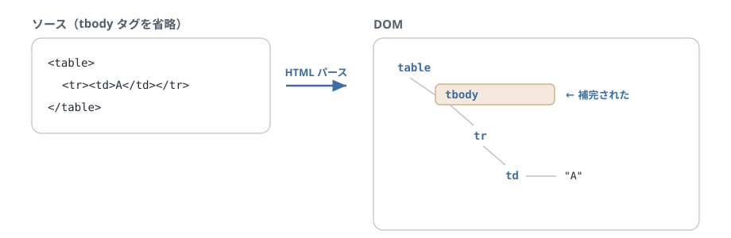

# 第5章 tbody はなぜ生まれるのか

ソースには `table` と `tr` しかないのに、DevTools では間に `tbody` がある。その結果、`table > tr` という CSS が当たりません。この現象を説明する鍵は、「どうやって DOM を作ったか」です。

## 5.1 タグを省略しても要素はできる

次の断片を、[第4章](chapter4.md)の確認用文書の `body` に入れます。

```html
<table>
  <tr><td>A</td></tr>
</table>
```

HTML パーサーがこの文字列を読むと、要素の関係は次のようになります。

```html
<table>
  <tbody>
    <tr><td>A</td></tr>
  </tbody>
</table>
```

これは不正な入力を修正した例ではありません。この位置では `tbody` の開始タグと終了タグを省略できます。**タグをソースに書かないことと、DOM に要素が存在しないことは別です。** パーサーには、表の中で `tr` の開始タグを受け取ると `tbody` を挿入して処理を続ける規則があります。

<figure>

<figcaption>図 5-1　この HTML 文字列のパースでは、tbody が挿入される。</figcaption>
</figure>

`tbody` は表の本体行をまとめる行グループです。見出し側の行グループには `thead`、末尾側には `tfoot` があります。行を区分したいときに役立つ構造ですが、「すべての表で tr の親は必ず tbody」と一般化すると、次の例を説明できません。

## 5.2 DOM API は同じ補完をしない

DevTools のコンソールで、HTML 文字列を使わずに表を作ってみます。

```js
const table = document.createElement('table');
const row = document.createElement('tr');
const cell = document.createElement('td');
cell.textContent = 'A';
row.append(cell);
table.append(row);
document.body.append(table);
console.log(table.firstElementChild.tagName); // "TR"
```

この場合、`append` は指定した親子関係でノードを追加し、`tbody` を自動挿入しません。table のコンテンツモデルも、tbody がない場合には直下の tr を許しています。したがって、この木が tbody を持たないこと自体は不適合ではありません。

一方、同じ表を HTML 文字列から作れば、HTML パーサーの規則が使われます。

```js
const parsedTable = document.createElement('table');
parsedTable.innerHTML = '<tr><td>A</td></tr>';
console.log(parsedTable.firstElementChild.tagName); // "TBODY"
```

要素を直接追加したのか、文字列をパースしたのか。その違いが DOM に現れます。フレームワークが作った表を調べるときも、ソースの見た目から親子関係を決めつけず、実際の DOM を確認する必要があります。

## 5.3 CSS は実際の親子関係を選ぶ

最初の HTML 文字列からできた表に対して、次の指定は一致しません。

```css
table > tr { background: #eee; }
```

`>` は直下の子を選ぶ記号です。この表の tr の親は tbody なので、本体行を選ぶなら次のように書けます。

```css
table > tbody > tr { background: #eee; }
```

`table tr` でも行を選べますが、意味は同じではありません。こちらは thead や tfoot の行、さらにセルの中に入れ子にした表の行にも届きます。「本体行だけ」なのか「子孫にあるすべての行」なのかで使い分けます。DOM API の例の表なら、最初の `table > tr` が一致します。

## 5.4 行を扱いたいときは表の API を使う

HTML 文字列から作った最初の表なら、次の結果になります。

```js
const sourceTable = document.querySelector('table');
console.log(sourceTable.children[0].tagName); // "TBODY"
console.log(sourceTable.rows.length);        // 1
console.log(sourceTable.tBodies[0].rows.length); // 1
```

`children` は直接の子要素を返します。`rows` は、その表の直下と thead・tbody・tfoot に属する行を集める表専用の API です。セル内に入れ子にした別の表の行までは含めません。特定の本体行グループだけを扱うなら `tBodies[0].rows` を使えますが、DOM API で作った例には tbody がないので、同じ式は使えません。

表を調べるときは、まず DOM がどう作られたかを確認し、次に「直接の子」「本体の行」「表全体の行」のどれが必要かを決めます。tbody を明示して書くと構造を読み取りやすくなりますが、挿入の理由はあくまで HTML のパース規則です。

次章では p の終了タグへ移り、正しい省略とエラー回復を比べます。

## 参考資料

* [HTML Living Standard: The table element](https://html.spec.whatwg.org/multipage/tables.html#the-table-element)
* [HTML Living Standard: Optional tags](https://html.spec.whatwg.org/multipage/syntax.html#optional-tags)
* [HTML Living Standard: The “in table” insertion mode](https://html.spec.whatwg.org/multipage/parsing.html#parsing-main-intable)
