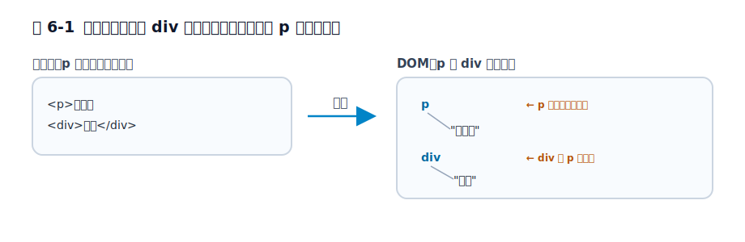

# 第6章 p タグはなぜ勝手に閉じるのか

この章では、`p` 要素の自動終了が「ブラウザの雑なごまかし」ではなく、壊れた入力から段落構造を救うための規則であることを見ます。ゴールは、`<p>` の中に `div` を入れたときに何が起きるかを、単なる挙動の暗記ではなく、「段落の中に置けないものが来たときにどこで区切るか」という構造の問題として説明できるようになることです。

前章では、`tbody` が内部モデルを保つために DOM 上で立ち上がることを見ました。この章では、同じ「内部は厳密・入力は寛容」という設計が、もっと身近な `p` 要素でどう現れるかを扱います。次章では個別の規則を離れて、HTML が壊れた入力全体をどう回復するのかへ進みます。

## 6.1 `p` は何でも包める箱ではない

`p` は見た目だけなら、ただの文章のまとまりに見えます。そのため、`div` や `section` のような他の要素も、中にそのまま入れられそうに感じるかもしれません。

しかし `p` は、何でも入る汎用コンテナではありません。`p` が表しているのは段落であり、1 つながりの文章として読まれる内容です。だから HTML では、段落の中に置けない要素が来たとき、そのまま入れ子にし続けるのではなく、どこかで段落を終わらせる必要があります。

ここで大事なのは、`p` の自動終了が「閉じタグを忘れても大丈夫」という甘い話ではないことです。先にあるのは「段落として成立する構造をどう保つか」という問題です。`p` は雑に広がる箱ではなく、段落という意味を持った要素だから、入れられないものが来た時点で境界を確定しなければなりません。

## 6.2 `div` が来たところで段落は閉じられる

いちばんよくある例を見ます。

```html
<p>前置き
<div>本文</div>
```

ソースだけを見ると、`div` が `p` の中に入っているように見えます。しかしブラウザが作る DOM は、その見た目どおりにはなりません。おおまかには次のように扱われます。

```html
<p>前置き</p>
<div>本文</div>
```

つまり、`div` が現れたところで `p` は暗黙に閉じられます。`div` を段落の中に押し込んだまま読むのではなく、「ここで 1 つの文章のまとまりは終わっていたはずだ」と解釈し直しているわけです。

<figure>

<figcaption>図 6-1　段落に置けない div が来ると、その手前で p が閉じる。</figcaption>
</figure>

この規則を知らないと、「ソースと DOM が違う」「閉じタグを書いていないのに閉じている」という不可解な現象に見えます。しかし HTML から見ると、段落の中に置けない要素が来た以上、どこかで段落を終わらせないと文書構造の整合が取れません。そこで `div` の直前で `p` を閉じる、という規則が必要になります。

> 手元で確かめる: `<p>前置き<div>本文</div>` をそのまま書いてブラウザで開き、DevTools の Elements パネルを見てください。`div` は `p` の子ではなく、`p` の外（兄弟）に並んでいるはずです。ソースでは入れ子に見えるのに、DOM では `div` の直前で `p` が閉じている——この食い違いを 1 度見ておくと、以降「閉じていないのに閉じている」現象に驚かなくなります。

## 6.3 自動終了は気分ではなく段落構造を守るための規則である

ここで誤解しやすいのは、「ブラウザがその場の雰囲気でいい感じに直している」という理解です。実際にはそうではありません。どの要素が `p` を閉じるかは、仕様の中で細かく決められています。

言い換えると、ブラウザは好き勝手に補っているのではなく、「この要素は段落の中に置けないので、ここで現在の `p` を終わらせる」という規則に従って処理しています。`div` が来たら必ずそうなるのは、偶然の実装ではなく、段落を段落として保つための決めごとだからです。

この視点を持つと、`p` の自動終了は `tbody` と同じ方向を向いていると分かります。`tbody` では表モデルを守るために本体階層を立ち上げ、`p` では段落モデルを守るために境界を確定する。どちらも、入力をそのまま信じるのではなく、内部の文書構造を整えているのです。

## 6.4 XML 的な厳格さとは違う方向を選んだ

この挙動は、厳格な文法処理に慣れていると不思議に見えます。もし XML 的な発想を強く持っていると、「入れられない要素が来たなら、その時点でエラーにして止めるべきではないか」と考えたくなります。

HTML はそこを別の方向に取りました。入力に問題があっても、できるかぎり読める文書構造へ回復するほうを優先します。だから `div` が `p` の中に見えても、「不正だから中断する」ではなく、「段落はここで終わっていたと解釈する」に進みます。

これは HTML が甘いというより、Web が閲覧を止めないために選んだ方針です。古いページ、手書きのページ、完全ではない出力を含めて、とにかく読める形へ持っていく。その積み重ねの上に現在のブラウザ実装があります。この章では `p` だけを見ていますが、次章で扱うエラー回復全体の入口でもあります。

## 6.5 「閉じ忘れても平気」という意味ではない

`p` が勝手に閉じると聞くと、「では閉じタグを気にしなくてもいい」と受け取られがちです。これは実務でかなり危ない誤解です。

ブラウザが最終的に読める形へ回復してくれることと、著者が曖昧な入力を書いてよいことは別です。ソース上でどこまでが段落なのか分かりにくくなれば、テンプレートを読む人も保守する人も混乱します。しかも、意図と違う位置で `p` が閉じられると、CSS や JavaScript の対象範囲も想定からずれます。

たとえば、ある説明文全体を 1 つの段落だと思ってスタイルやスクリプトを書いていても、途中に置いた要素によってブラウザ側では段落が分断されているかもしれません。その状態で「なぜこの要素だけ段落の外に出ているのか」と悩み始めると、原因がソースではなく暗黙終了にあることに気づくまで時間を失います。

実務では、「ブラウザが回復してくれるから大丈夫」と考えるより、「なぜその回復が起きたのか」を理解して、曖昧なマークアップを減らすほうが重要です。この章の価値は、閉じ忘れを正当化することではなく、段落構造がどう守られているかを説明できるようになることにあります。

## 6.6 段落モデルを守る終了規則

`p` の自動終了は、ブラウザの雑なごまかしではありません。段落の中に置けない要素が現れたときに、どこで段落を終わらせれば文書構造を壊しすぎずに済むかを決めた規則です。

この見方を持つと、`<p>` の中に `div` を書いたときに DOM では段落が先に閉じている理由を、素直に説明できます。`tbody` が表モデルを守っていたのと同じように、`p` の暗黙終了は段落モデルを守っています。次章では、この個別規則の背後にある HTML 全体のエラー回復を、もう少し広い視点から見ます。

## 参考資料

* [HTML Living Standard: The `p` element](https://html.spec.whatwg.org/multipage/grouping-content.html#the-p-element)
* [HTML Living Standard: Parsing HTML documents](https://html.spec.whatwg.org/multipage/parsing.html)
* [MDN Web Docs: `<p>`](https://developer.mozilla.org/ja/docs/Web/HTML/Element/p)
