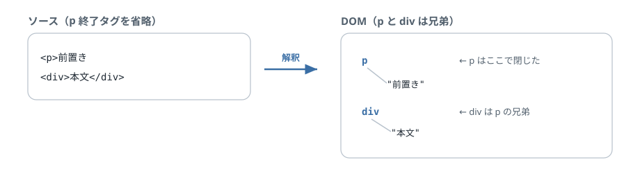

# 第6章 p タグはなぜ勝手に閉じるのか

`</p>` を書いていないのに、DevTools では段落が終わっている。これは閉じ忘れの救済とは限りません。HTML には、終了タグを正しく省略できる条件があります。

## 6.1 段落の内容とタグ省略は別の規則

p 要素の内容は phrasing content（文章の中身になるテキストや要素）です。たとえばテキスト、em、a、img などを含められます。div はこの分類に入らないので、p の子にすることはできません。

ただし、「内容にできない要素が来れば、パーサーが必ず p を閉じる」という一般則があるわけではありません。著者が何を入れられるかというコンテンツモデルと、パーサーが各開始タグをどう処理するかは別々に規定されています。

## 6.2 div の前では終了タグを省略できる

[第4章](chapter4.md)の確認用文書の body に、次の断片を入れます。

```html
<p>前置き
<div>本文</div>
```

p の直後が div になる位置では、p の終了タグを省略できます。この入力は、その省略条件に適合します。要素の関係を終了タグ付きで表すと、次のようになります。

```html
<p>前置き</p>
<div>本文</div>
```

ソースの改行や字下げで親子関係が決まるわけではありません。パーサーはこの div の開始タグを受け取ると、開いている p を閉じてから div を作ります。ここでは p と div は兄弟であり、div が p の中から「移動した」のではありません。

<figure>

<figcaption>図 6-1　div の前で p の終了タグを省略しても、段落の境界は決まる。</figcaption>
</figure>

## 6.3 最後に終了タグを足すと別の入力になる

では、全体を p で囲むつもりで、末尾に終了タグを足すとどうなるでしょうか。

```html
<p>前置き<div>本文</div></p>
```

この入力では、div の前で p はすでに閉じています。最後の `</p>` に対応する開いた p はありません。これはパースエラーです。パーサーはこの場面で p を作って閉じるため、結果は次のようになります。

```html
<p>前置き</p>
<div>本文</div>
<p></p>
```

最後の空の p が、エラー回復の結果です。validator は余った終了タグを指摘します。「終了タグを足せば必ず正しくなる」とは限りません。段落と別のまとまりに分ける意図なら、p の終了タグは div より前に書きます。

```html
<p>前置き</p>
<div>本文</div>
```

## 6.4 省略できても、境界を明示する価値がある

p の終了タグ省略は正当な構文です。しかしテンプレートの分岐や部品の組み合わせが入ると、何が直後に来るかを見失いやすくなります。終了タグを明示すると、段落の範囲をソースだけでも確認しやすくなります。

調査では、まず終了タグの省略条件に合うかを確認し、次に DOM に余分な要素ができていないかを見ます。正しい省略とエラー回復を分けると、「ブラウザが勝手に閉じた」という同じ見た目から、別々の原因を取り出せます。[第7章](chapter7.md)では、さらにコンテンツモデルへの不適合を加えて整理します。

## 参考資料

* [HTML Living Standard: The p element](https://html.spec.whatwg.org/multipage/grouping-content.html#the-p-element)
* [HTML Living Standard: The “in body” insertion mode](https://html.spec.whatwg.org/multipage/parsing.html#parsing-main-inbody)
