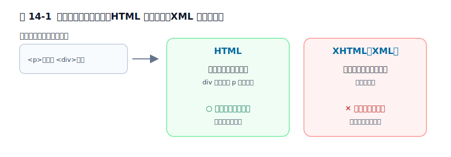

# 第14章 XHTML はなぜ広まらなかったのか

たった 1 つの閉じ忘れで、ページ全体が表示されず、黄色いエラー画面になる——そんな厳格な HTML が、かつて本気で目指されていました。XHTML です。理想は美しかったのに、Web には広まりませんでした。なぜでしょうか。

この章では、XHTML を「失敗した厳格主義」と雑に片づけるのではなく、筋の通った理想がなぜ公開 Web の条件と噛み合いにくかったのかを見ます。ゴールは、XHTML の挫折を「正しさが負けた」と読むのではなく、「どの環境では筋が通り、どの環境では重すぎたのか」を説明できるようになることです。

前章では、消えた要素たちを、著者の需要と標準の学習の痕跡として見ました。この章では逆に、理想をもっと厳密に押し進めた側の試みを扱います。次章では、その衝突から浮かび上がる後方互換性の重さを見ます。

## 14.1 XHTML の理想自体は筋が通っていた

XHTML は、HTML を XML の流儀で書き直し、文法を厳密にそろえようとする試みでした。XML は、文書やデータを厳密なルールで記述するための形式です。開始タグも終了タグもきちんと閉じる。入れ子も厳密に守る。曖昧な省略に頼らない。考え方としてはかなり筋が通っています。

この理想が魅力的だったのは、文書を機械的に扱いやすくなるからです。著者にとっても、実装者にとっても、「正しい入力だけを相手にする」世界は分かりやすい。第2部で見てきたような回復規則や暗黙補完に悩まされにくいからです。

つまり XHTML の問題は、理想が雑だったことではありません。むしろ逆で、理想は整っていました。問題は、その理想を公開 Web 全体へそのまま持ち込めるかどうかでした。

## 14.2 XML 的な停止は公開 Web ではコストが高かった

違いがもっともよく見えるのは、壊れた入力をどう扱うかです。HTML は少し壊れていても回復しながら読み進めますが、XML では不正な入力をそのまま処理し続けることはできません。

```html
<p>前置き
<div>本文</div>
```

HTML なら、第6章で見たように、`div` の手前で `p` を閉じる形へ回復して読み進められます。しかし XHTML を本当に XML として扱うなら、この種の崩れは「何となく読めるから続行」で済みません。入力が正しくなければ、その時点で文書全体を機械的に止めるほうが筋です。

この厳密さは、閉じたシステムや入力を厳密に管理できる環境では力になります。けれど公開 Web は、古い文書、手書きの文書、完全ではない出力、雑多なツールが混ざる空間です。そこでは、著者の小さなミス 1 つでページ全体が読めなくなるコストが高すぎました。実際、XML として配信された XHTML では、たった 1 つの閉じ忘れでページが表示されず、ブラウザが黄色いエラー画面を出すことがありました。これは当時、俗に "yellow screen of death（黄色い死の画面）" と呼ばれたほどです。

<figure>

<figcaption>図 14-1　同じ壊れた入力でも、HTML は回復し、XML は止まる。</figcaption>
</figure>

## 14.3 `text/html` のままでは理想も現実も変わらなかった

ここで「配信」について補っておきます。サーバーがページを返すとき、本文だけでなく「これは `text/html` です」「これは `application/xhtml+xml` です」といった**中身の種類（MIME タイプと呼びます）**も一緒に伝えます。ブラウザはこの種類を見て、HTML として読むか、厳格な XML として読むかを切り替えます。

ここに XHTML の難しさがもう 1 つ出ます。XHTML 風の書き方をしていても、`text/html` として配信されれば、多くの場面ではブラウザは HTML として処理します。つまり、見た目だけ XHTML らしくしても、処理系の根本が XML に切り替わるわけではありません。

これは実務ではかなり重要です。末尾に `/` を付ける、属性をきれいに閉じる、といった書き方だけを取り入れても、配信形式が `text/html` のままなら、ブラウザは第2部で見た HTML パーサーとして動き続けます。理想の文法へ寄せたつもりでも、運用上の前提が変わらなければ、根本の挙動は変わりません。

一方で、本当に XML として扱わせるために `application/xhtml+xml` で配信すると、今度はわずかな不正で文書全体が止まりやすくなります。結果として、多くの現場では「書き方だけは厳密に寄せるが、配信と処理は HTML のまま」という折衷に落ちやすかった。これは理想を中途半端に裏切ったというより、公開 Web の条件がそれを求めたと見るほうが正確です。

言い換えると、`text/html` のままでは理想の処理系へ届かず、`application/xhtml+xml` へ振り切ると公開 Web には厳しすぎた、という二重の難しさがありました。XHTML が広がりきらなかったのは、この板挟みを解く現実的な道が細かったからでもあります。

ここで見えてくるのは、XHTML の広がらなさが、思想の弱さではなく、導入コストの高さにも由来していたことです。理想を通すなら、Web 全体に「壊れたら止まる」を受け入れてもらう必要がある。しかし公開文書空間としての Web は、その方向へは動きにくかったのです。

## 14.4 HTML5 は理想を捨てたのではなく、現実を仕様化した

この流れの先で重要なのが、HTML5 以降の方向転換です。XML の理想をさらに推し進めようとした XHTML 2.0 は、結局 2009 年に開発が打ち切られ、現実路線の HTML5 が後継として選ばれました。ここで起きたのは、「もう正しさは不要だ」と開き直ったことではありません。現実のブラウザがすでにしていた回復や補完を、曖昧な慣習のままではなく仕様として書き下ろす方向へ進んだのです。

つまり XHTML の経験が残した教訓は、厳密さそのものの否定ではありません。公開 Web では、厳密さを入力側だけに押しつけると利用可能性が壊れる。だから、入力は現実に合わせて寛容に受け止めつつ、内部処理は仕様として厳密にそろえる必要がある。この考え方は、第2部で見たエラー回復ともつながっています。

ここまでで、XHTML が広まらなかった理由は「正しいことを言っていたのに理解されなかった」でも、「厳密さが悪だった」でもないと分かりました。公開 Web という壊れやすいが止められない空間では、XML の理想をそのまま持ち込むにはコストが高すぎたのです。次章では、その結論がなぜ「昔のページを壊さないこと」へつながるのかを見ます。

## 参考資料

* [XHTML 1.0: The Extensible HyperText Markup Language](https://www.w3.org/TR/xhtml1/)
* [HTML Living Standard: Parsing HTML documents](https://html.spec.whatwg.org/multipage/parsing.html)
* [MDN Web Docs: XHTML](https://developer.mozilla.org/en-US/docs/Glossary/XHTML)
