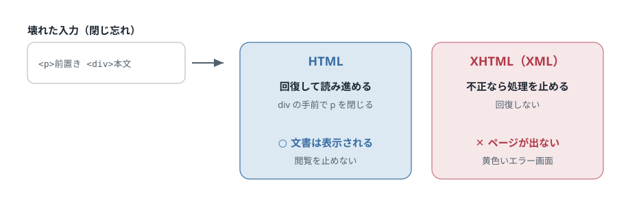

# 第14章 XHTML はなぜ Web の主流にならなかったのか

タグを閉じ忘れたら文書を処理し続けない。XML の整形式の規則で HTML を扱う XHTML は、入力を厳密に管理したい場面には魅力的でした。しかし公開 Web を一斉にその方式へ移すことはできませんでした。

ここで区別したいのは、XHTML 1.x の記法が使われたこと、XML として配信されたこと、XHTML 2.0 の開発が終了したことです。この三つをまとめて「XHTML は誰も使わなかった」とするのは不正確です。

## 14.1 XML の厳密さは何を検査するのか

XML は、開始タグと終了タグの対応や入れ子などの整形式を要求します。たとえば次の断片を文書の本文に置き、後ろに p の終了タグを補わなければ、XML では整形式の違反になります。

```html
<p>前置き
<div>本文</div>
```

HTML では、[第6章](../part2/chapter6.md)で見たように div の前で p の終了タグを省略できるので、この本文断片は適合する書き方です。同じ記号列でも、処理系によって許される構文が違います。

ただし XML の整形式検査と、XHTML の要素の意味・配置の検査は別です。`<p><div>本文</div></p>` はタグが対応しているため整形式ですが、p の内容として div を許すわけではありません。「XML として読めた」だけでマークアップ全体が適合すると判断してはいけません。

<figure>

<figcaption>図 14-1　HTML の正しい省略も、XML の規則ではエラーになる。</figcaption>
</figure>

## 14.2 記法だけでは XML の処理に切り替わらない

サーバーは Content-Type という HTTP ヘッダーで文書の種類を伝えます。`text/html` として配信すれば HTML パーサー、`application/xhtml+xml` として配信すれば XML パーサーで処理されます。

XHTML 風に小文字のタグを使い、属性を引用符で囲み、空要素に `/` を付けても、text/html で送れば HTML として処理されます。XHTML 1.0 には、互換性のガイドラインに従った文書を text/html で提供する扱いもありました。記法の利用と XML 配信は同じではなかったのです。

XML 配信では、整形式の違反が致命的なエラーとなり、通常の処理を続けられません。入力を一元管理できるシステムでは早期検出に役立ちますが、複数のテンプレートや外部の断片を組み合わせる公開サイトでは、ページを読めなくする影響も考慮する必要がありました。

## 14.3 当時のブラウザ対応という障壁

厳密さへの好みだけでは説明できない事情もあります。W3C の当時の XHTML FAQ は、Internet Explorer が application/xhtml+xml をサポートしないことを挙げています。これは当時の配信判断に関する史料であり、現在のブラウザ対応表ではありません。

主要な閲覧環境へ届ける必要があれば、著者は記法を XHTML に寄せながら text/html で配信する選択を取り得ます。その場合、XML の処理へ移行したわけではありません。XHTML が主流にならなかった理由を、著者が厳密さを嫌ったからだけで説明することはできないのです。

## 14.4 XHTML 2.0 の終了と HTML の継続

W3C は 2009 年、XHTML 2 Working Group の任期を更新せず、HTML5 に資源を振り向ける方針を示しました。これは XHTML 1.x の既存文書がその日に無効になったという意味ではありません。

HTML5 では、現実のブラウザが扱う入力と互換性を踏まえ、HTML のパースやエラー回復を詳しく規定する方向が進みました。著者向けの適合性を捨てたのではなく、不適合な入力にも共通の処理規則を与えたのです。

実務で確認すべきなのは、文書の見た目の記法だけでなく、何の種類として届き、どのパーサーが読むかです。末尾のスラッシュだけで処理系を判断せず、レスポンスの Content-Type を確認すると、この歴史が現在の調査にもつながります。

## 参考資料

* [XHTML 1.0: Internet Media Type](https://www.w3.org/TR/xhtml1/#media)
* [W3C: XHTML FAQ（当時の配信とブラウザ対応）](https://www.w3.org/MarkUp/2004/xhtml-faq)
* [W3C: FAQ about the future of XHTML（2009年）](https://www.w3.org/2009/06/xhtml-faq.html)
* [XML 1.0: Well-Formed XML Documents](https://www.w3.org/TR/xml/#sec-well-formed)
