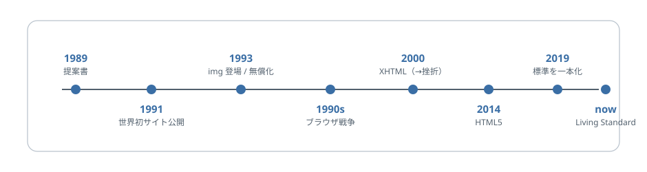

# 第21章 ティム・バーナーズ＝リーが残したもの

ティム・バーナーズ＝リー（Tim Berners-Lee）を「HTML を作った人」とだけ覚えるのではなく、なぜ Web が公開された文書の網として出発したのかを、その初期設計から見ます。

## 21.1 HTML だけでは Web にならない

ティム・バーナーズ＝リーの名前は、しばしば HTML の発明者として紹介されます。それは間違いではありません。しかし、この本の流れで重要なのは、HTML だけを取り出しても Web は成立しないことです。文書の中にリンクを書けても、そのリンク先をどの名前で指し、どう取りに行くかが決まっていなければ、世界に散らばる文書はつながりません。

そこで初期の Web では、文書の構造を記す HTML、場所を指し示す URL、文書をやり取りする HTTP が一体の仕組みとして設計されました。残されたものは単独のタグ集合ではなく、「どこにある何を、どう参照し、どう受け取るか」という公開文書の最低限の約束です。

もちろん、後の Web を育てたのは一人ではありません。ブラウザ実装者、標準化団体、著者、サーバー側の開発者がそれぞれに形を作ってきました。それでも出発点として、この三つを公開された組として置いたことは、後の発展方向を強く縛る初期条件になりました。

この一体性を先に見ておくと、HTML が最初から単なるマークアップ言語の話ではなかったことも分かります。HTML は、リンクされる文書という前提の中で生まれた。だから後の章で見る互換性や標準化の議論も、文書の記法だけでなく、公開された網を保つ話として読めるようになります。

この第6部から第7部にかけて扱う歴史は、ざっと次のように流れます。細部はこれからの章で見ていきますが、先に全体像を持っておくと迷いません。

<figure>

<figcaption>図 21-1　HTML は完成したのではなく、調整され続けてきた。</figcaption>
</figure>

## 21.2 解決したかったのは閉じた文書管理ではなかった

[第2章](../part1/chapter2.md)では、CERN（欧州原子核研究機構）の情報共有問題から Web が始まったことを見ました。ここで改めて重要なのは、解決策が巨大で複雑な文書管理システムではなく、比較的単純な公開と参照の仕組みとして組み立てられたことです。

最初のサーバーやサイトは CERN で作られました。[CERN の記録](https://home.cern/science/computing/the-birth-of-the-web/where-web-was-born/)は、最初のサイトとともに、1993 年4月30日に Web のソフトウェアをパブリックドメインへ置いたことを伝えています。これは Web 上のすべての文書の権利をなくしたという意味ではなく、基盤となるソフトウェアを利用できるようにする措置でした。

たとえば、ある研究資料を読み、その中の別文書への参照をたどり、その先へ移る。初期の Web が目指したのは、その動作を特別な契約や専用端末に依存せずに成立させることでした。そのためには、文書はある程度単純で、場所は共有できる形で表され、通信方法も公開されている必要があります。

ここでティム・バーナーズ＝リーが残したものは、「最初の Web サイトを作った」という出来事より、公開された約束で回る仕組みを最初から選んだことです。もしここで、特定ソフトウェアの中だけで通じる文書形式や、閉じた識別子や、独自の通信方式が選ばれていたら、後の Web はかなり違う形になっていたはずです。

## 21.3 公開された仕様と利用できる実装

公開された通信や文書の約束に加え、実装を利用できる条件も普及を支えました。1993 年の [CERN の公開文書](https://cds.cern.ch/record/1164399)は、この制度上の判断を確かめる資料です。[第2章](../part1/chapter2.md)の「情報をつなぐ必要があった」という問題設定に対し、ここでは「他の人も参加できる条件をどう用意したか」を見ています。

もちろん現実の Web は、その後ずっと理想どおりだったわけではありません。商用化も起きたし、ブラウザ間の競争も起きたし、独自拡張も大量に生まれました。それでも「公開された文書の網」という出発点があったからこそ、Web は完全に誰か一社の製品にはなりませんでした。

この意味で、ティム・バーナーズ＝リーが残したものは発明品の数ではありません。HTML、URL、HTTP を通して、文書公開の仕組みを閉じた製品ではなく、共有された土台として始めたことです。後の標準化団体や仕様策定者が何を守ろうとしたのかも、この初期条件を踏まえると見えやすくなります。

## 21.4 人物伝ではなく、初期条件として読む

この章で人物を大きく扱うのは、英雄譚を書きたいからではありません。本書の主題は、HTML がなぜ今の形になったのかです。その答えの一部は、最初にどんな条件で Web が始まったかにあります。

ティム・バーナーズ＝リーを「偉人」として消費してしまうと、話は豆知識で終わります。しかし「HTML は公開された文書の網の一部として設計された」と読むと、その後の互換性重視、標準化、実装の苦労まで一本の線でつながります。各社のブラウザが競い合えたのも、そもそも同じ Web を読むという共有土台があったからです。[第22章](chapter22.md)では、その土台の上で起きたブラウザ戦争が、なぜ混乱であると同時に標準化の必要性を浮かび上がらせたのかを見ます。

## 参考資料

* [Tim Berners-Lee: Information Management: A Proposal](https://www.w3.org/History/1989/proposal.html)
* [W3C: A Little History of the World Wide Web](https://www.w3.org/History.html)
