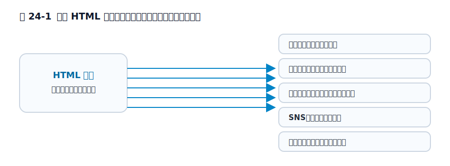

# 第24章 HTMLは誰に読まれているのか

この章では、HTML を「ブラウザに表示させるための記述」とだけ見るのではなく、複数の読み手に向けた共通の文書形式として見ます。ゴールは、HTML の相手が人間の目だけではないことを理解し、なぜ見た目が合っているだけでは不十分なのかを説明できるようになることです。

前章では、HTML が実装者や標準化団体によって運用され続ける仕様だと見ました。この章では、その仕様がなぜ細かく整えられ続けるのかを、HTML を読む側の広さから見ます。次章では、その広さが HTML の長寿にどうつながるかを扱います。

## 24.1 ブラウザは代表的な読み手にすぎない

HTML を最初に思い浮かべるとき、多くの人はブラウザ画面を想像します。それは自然です。実際、ブラウザは HTML の主要な読み手です。しかし HTML を受け取るのはブラウザだけではありません。検索エンジンは文書構造から内容を推定し、スクリーンリーダーは見出しやランドマークを頼りに移動経路を作り、SNS やチャットツールはメタデータを読んでカード表示を組み立てます。スクリーンリーダーは、画面の内容を音声などで読み上げる支援技術です。ランドマークは、`nav` や `main` のようにページの大きな領域を示す手がかりだと思えば十分です。メタデータは、ページの題名や概要のような補助情報です。

さらに、翻訳システム、保存サービス、アーカイブツール、リーダーモードのような機能も HTML を読みます。リーダーモードは、記事本文を読みやすく抜き出して表示する機能です。ここで共通しているのは、どの相手も見た目そのものではなく、文書の構造や意味の手がかりを受け取っていることです。つまり HTML は、ひとつの画面を出すための材料である前に、多数の相手が解釈する共通文書です。第1章で HTML をプログラミング言語ではなく文書構造の記述だと見た意味も、ここで活きてきます。

<figure>

<figcaption>図 24-1　HTML を読むのはブラウザだけではない。</figcaption>
</figure>

## 24.2 見た目だけ合っていても、同じ文書にはならない

この事実は、HTML を単なる見た目の足場として扱う危うさを示します。たとえば、ブラウザ画面ではそれらしく見えていても、見出し構造が崩れていたり、表に見えるものが実際には `div` の並びだったりすると、別の読み手には同じ文書として届きません。

検索エンジンは文書の主題や階層を読み取りにくくなり、スクリーンリーダー利用者はどこへ飛べばよいかを掴みにくくなります。SNS のカード生成もうまく要約できないかもしれません。つまり「画面として見える」ことと、「文書として伝わる」ことは同じではありません。

ここで問われているのは、HTML が正しいかどうかをテストの正誤で裁くことではありません。どの読み手に、どの構造が渡るのかという問題です。HTML の意味づけは、ブラウザの装飾前にある土台として、多数の利用者へ共有されています。

## 24.3 HTML は人間の目の裏側にある共通言語である

本書のここまでの議論が「なぜ HTML に意味が必要なのか」へ収束してきたのはそのためです。`table` `div` `b` `strong` のような議論も、単に好みの問題ではなく、どの読み手に何を渡すのかという問題でした。

HTML は、人間が見る画面の裏側で、多数の読み手に向けて意味を配る共通言語です。だからこそ、古く見える文法や、仕様書の細かな規定が今も役割を持ち続けます。見た目だけで完結する技術なら、ここまで長く互換性や意味づけが議論される理由はありません。

## 24.4 読み手の多さが、HTML のしぶとさを支えている

この章で言いたいのは、「HTML は検索エンジンにも読まれる」といった雑学ではありません。HTML が長く生きているのは、多数の読み手が同じ文書をそれぞれの目的で使っているからでもあります。ブラウザのためだけの技術なら、もっと別の形式へ置き換わっていたかもしれません。

しかし実際には、表示、検索、読み上げ、引用、保存、要約といった多くの処理が HTML を土台にしています。だから HTML は、古いのに消えないのではなく、多数の読み手のあいだで今も役に立っているから残っているのです。第25章では、そのしぶとさを、後方互換性、オープン性、シンプルさの観点から見ます。

## 参考資料

* [MDN Web Docs: Accessibility](https://developer.mozilla.org/ja/docs/Web/Accessibility)
* [Google Search Central: HTML と検索](https://developers.google.com/search/docs/fundamentals/creating-helpful-content)
