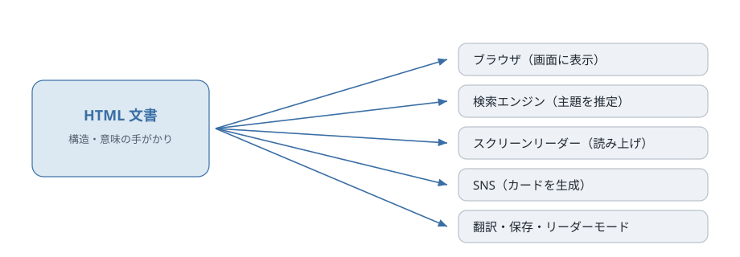

# 第24章 HTML は誰に読まれているのか

画面で読める画像でも、画像を見ない人に同じ情報が届くとは限りません。HTML の役割がよく見えるのは、一つの内容を違う方法で利用する場面です。

## 24.1 情報が届く経路は一つではない

ブラウザは HTML から DOM を作り、CSS などと組み合わせて表示します。また、要素の役割・名前・状態などをアクセシビリティ情報として支援技術へ伝えます。スクリーンリーダーはこうしたブラウザや OS の提供する情報を使い、読み上げや見出し間の移動を助けます。単に HTML ソースを直接読み上げるだけの道具ではありません。

一方、検索サービスや保存ツールは、取得した HTML や、場合によってはスクリプトを実行した結果から内容を扱います。どの段階を利用するかはサービスによって違います。「ブラウザで見えたから、すべての読み手にも同じ情報が渡る」とは限りません。

<figure>

<figcaption>図 24-1　同じ HTML でも、読み手へ情報が渡る経路は異なる。</figcaption>
</figure>

## 24.2 alt は画像の用途から決める

代替テキストは、ファイル名や画面の説明を機械的に付ければよいものではありません。その画像が、この文脈で何を伝えているかから決めます。

情報を伝える画像なら、その情報を短いテキストで置き換えます。

```html

```

装飾だけで、取り除いても情報を失わない画像なら、空の alt を使います。

```html

```

`alt=""` と、alt 属性を書かないことは同じではありません。空の値は、この文脈では代替テキストを提示する必要がないことを示します。説明がないというだけで省略すると、支援技術がファイル名などを読み上げる場合があります。

画像だけのリンクなら、見た目より行き先や機能が分かる名前が必要です。

```html
<a href="/search"></a>
```

「虫眼鏡の画像」より「検索」のほうが、このリンクを使う目的を伝えます。同じ画像でも、隣に「検索」というリンクテキストがあれば、画像側を空の alt にして重複を避ける設計もできます。

複雑なグラフなどは、短い alt だけでは情報を運びきれません。本文の説明やデータ表も用意します。alt は画像の万能な解説欄ではなく、周囲の内容と合わせて情報を届けるための一部です。

## 24.3 本文の意味とカード用メタデータ

見出しや表の構造は、本文の読み方を伝えます。nav や main は主要な領域への移動を助けます。これらを見た目だけの div にすると、画面が似ていても渡せる意味が減ります。

SNS のカード生成は、Open Graph の title・description・image などのメタデータを参照する場合があります。これは本文の h1 や表の構造とは別の情報です。見出しを直しただけでカードの説明まで直るとは限りません。利用するサービスの確認画面で、題名・概要・画像を別途確認します。

検索エンジンについても、正しい要素を使うことだけで検索順位が決まるわけではありません。内容の有用性と、機械に渡せる構造は、関連していても同じ評価項目ではないのです。

## 24.4 見た目の確認から一歩進める

画像を選ぶときは、まず用途が情報・装飾・機能のどれかを考え、周囲の文章と重複しない代替テキストにします。見出しや領域は、ブラウザのアクセシビリティ情報でも意図した名前と役割になっているかを見ます。さらにキーボードや支援技術を使って、実際に移動・操作できるかを確認します。

HTML の意味づけは、仕様の問題をなくすためだけのものではありません。画面以外の経路でも、利用者が同じ情報へたどり着けるようにするための手がかりです。

## 参考資料

* [W3C WAI: Images Tutorial](https://www.w3.org/WAI/tutorials/images/)
* [W3C WAI: Decorative Images](https://www.w3.org/WAI/tutorials/images/decorative/)
* [W3C WAI: Functional Images](https://www.w3.org/WAI/tutorials/images/functional/)
* [HTML Accessibility API Mappings](https://www.w3.org/TR/html-aam-1.0/)
* [The Open Graph protocol](https://ogp.me/)
* [Google Search Central: Creating helpful, reliable, people-first content](https://developers.google.com/search/docs/fundamentals/creating-helpful-content)
